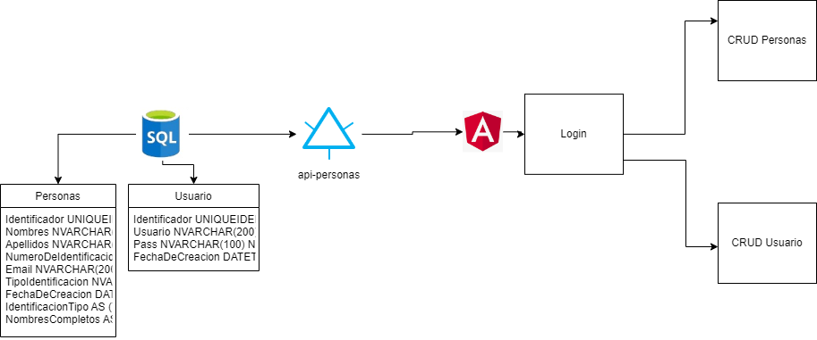
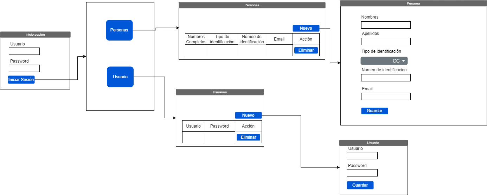

# DevTest

Proyecto "Prueba _ Desarrollador .Net" para Double V Partners

# Desarrollado por

Alejandro Castro Agudelo - alejoagu26@gmail.com

# Instrucciones

❖ La siguiente es una prueba técnica donde tendrás completa libertad
para proponer,idear, planear y plasmar tu filosofía de trabajo.
❖ La duración estimada para completar la prueba es de 2 días exactos
para terminarla a partir de la hora en que la recibas.
❖ A continuación te envío la prueba técnica y la prueba de conceptos
para que la puedas realizar.(la prueba técnica la debes compartir en
un repositorio GITHUB).
Adjunto los ejercicios de la prueba Técnica:
● Crear una base de datos en SQL con la siguiente estructura
- Entidad Personas con los siguientes atributos
■ Identificador.
■ Nombres.
■ Apellidos.
■ Número de identificación.
■ Email.
■ Tipo identificación.
■ Fecha de creación.
■ Columna calculada número de identificación con tipo de
identificación concatenados.
■ Columna calculada nombres y apellidos concatenados.
■ Un store procedure para consultar las personas creadas
- Entidad Usuario con los siguientes atributos■ Identificador
■ Usuario
■ Pass
■ Fecha de creación
● Crear un formulario web por medio del cual se inserte la entidad
Personas y Usuario mencionadas en el punto anterior, el formulario
debe solicitar los campos de las entidades.
● Crear un formulario web por medio del cual valide el login de las
personas que tenga registro en la tabla Usuario en el punto anterior,
el formulario debe solicitar usuario y pass.
● La comunicación entre la aplicación y la base de datos se debe
realizar por medio de una API rest.

# Propuesta de solución

# Propuesta de UX

# Base de datos

[Aquí](./recursos/sql/doublevpartners-pruebadev-scriptbasedatos.sql) encontrarás el script para la creación de la base de datos

# FrontEnd

[Aquí](./DvpTestFrontend/README.md) encontrarás la información del proyecto frontend

# Backend

[Aquí](./DvpTestBackend/README.md) encontrarás la información del proyecto backend
